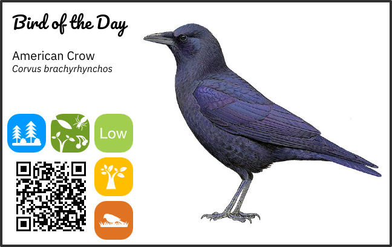

# BulletinBird - a small, friendly 'bird of the day' server



BulletinBird is a small app that serves up a new bird of the day every morning.

## Features

BulletinBird provides a REST API for getting data about a the randomly-selected bird of the day. The data is obtained from the [Cornell Lab of Ornithology's taxonomy guide](https://www.allaboutbirds.org/guide/browse/taxonomy) and includes:

- Common name
- Scientific name
- Species characteristics
  - Habitat
  - Diet
  - Nest type
  - Behavior
  - Conservation status

BulletinBird also provides static images for display on IoT-type devices. Currently, BulletinBird generates images specifically for the [Pimoroni Inky Impression 4](https://shop.pimoroni.com/products/inky-impression-4) and the [AdaFruit Magtag](https://www.adafruit.com/magtag).

The static images include:

- Scientific illustration
- Icons for species characteristics
- QR code that links to the Cornell Ornithology page for the bird of the day

## Dependencies

- Go 1.20.x
- Mage

## Support

BulletinBird builds and runs on MacOS (tested on 13.4.1 Ventura) and Linux (tested on Raspbian Bullseye and Armbian Bullseye). It probably runs on any \*nix, but has not been tested. Windows is anybody's guess.

## Cloning and Compiling

Clone the repository

```
$ git clone https://github.com/13-bit/bulletinbird
$ cd bulletinbird
```

Build and run

```
$ mage build
$ ./build/bulletinbird
```

Alternatively, you can install it in $GOPATH/bin

```
$ mage install
```

## Fonts

BulletinBird uses Google's [Pacifico](https://fonts.google.com/specimen/Pacifico/about) and IBM's [Plex](https://github.com/IBM/plex) font, both of which are licensed under the [Open Font License](https://scripts.sil.org/cms/scripts/page.php?site_id=nrsi&id=OFL). Copies of the license are included with the fonts.
